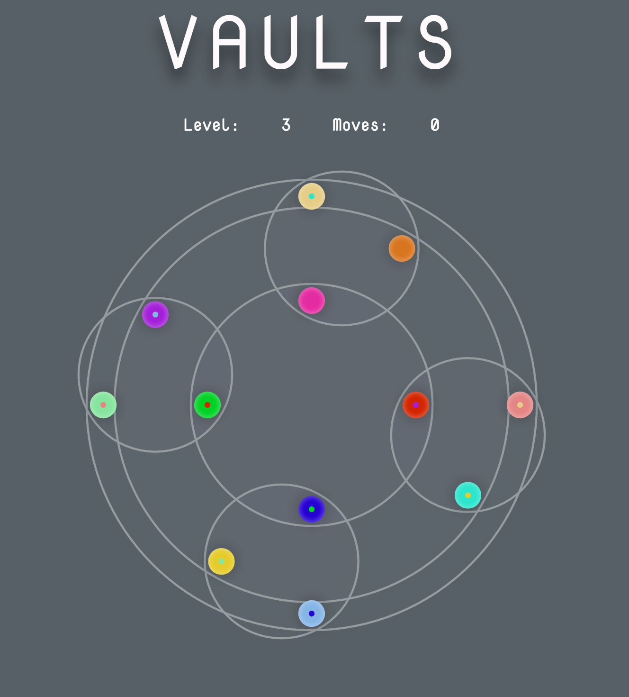

## Vaults

[Play](https://samthrasher.github.io/Vaults)

### Background

VAULTS is an original puzzle game based on combination puzzles like the
Rubik's Cube, the Lights Out puzzle, and similar games. The game board consists
of overlapping rings with marbles sitting on them. Clicking on the rings
causes the marbles to rotate along them. Some rings are linked
together so that clicking one ring causes both to rotate. The goal is to get each
marble into its designated spot, as indicated by the smaller colored dots.

### Controls

Click a ring to rotate clockwise. Shift-click to rotate counterclockwise.
That's it!

The puzzles range from relatively simple to devilishly tough:

### Next steps

More levels would be nice, of course. There are multitudes of possibilities for
interesting puzzles of this form. It would be interesting to see if it's
possible to use VAULTS to create puzzles that are isomorphic to ones
like the Rubik's Cube.

Right now this game is probably very difficult for colorblind people to play.
I'd like to add a colorblind mode which would use patterns instead of colors
to indicate the marbles' goal positions.

### Architecture and Technologies

VAULTS is implemented using the following technologies:
- Redux for organizing game/render logic
- React.js for DOM manipulation and dynamic element styling
- CSS3 animations
